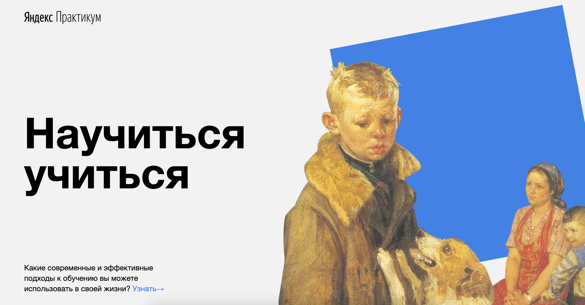

# How to learn
## Страница о том, как правильнее и эффективнее учиться новому и не бросать начатое.

___________________________

___________________________

Технологии, которые используются в проекте:

- Постороение сеток используя flex.
- Позиционирование изображений с ипользование position.
- Использование модификаторов ключ-значение.
- Использование псевдоклассов для задавания им уникальных свойст.
- Вставка видео через iframe.
- Использование анимации на объекты через keyframes.
- Впервые была использована методология БЭМ, которая предлагает несколько подходов к организации  файловой структуры: Nested.

___________________________

Ссылка на проект:

[How to learn](https://niksonglikson.github.io/how-to-learn/)
